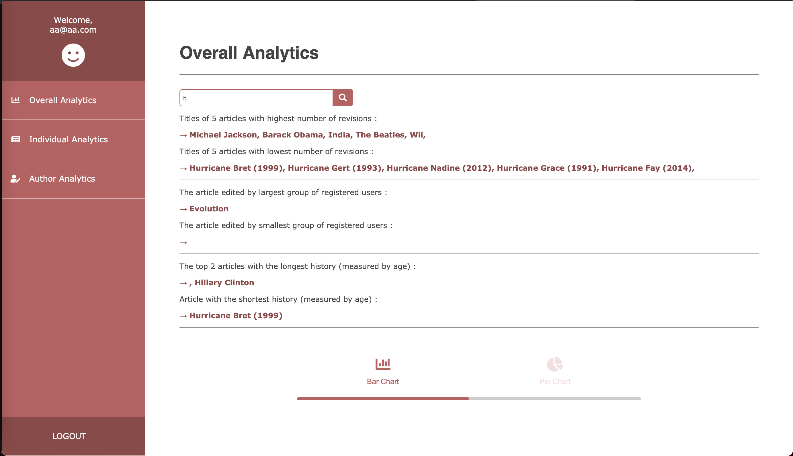
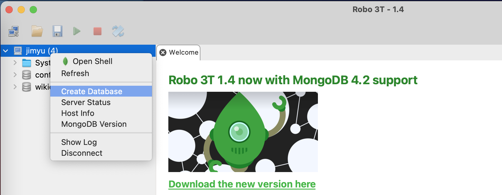

# Data-Analytics-Web-App  
This is a full-stack web app to analyze data from wikipedia revisioins. Data is analyzied based on articles and authors, simple visualization is also provided.
 
The web app uses html, node.js with express and ejs(embedded javascript templates), mongodb and MVC framework.  
 

 
 

## To run app:
1) Have Mongodb installed, create a database named `wikidata`   
Screenshot is provided using Robo3T:  
 
2) Run `npm install` on root directory 
3) cd to /app/import/ and run `node update`. After the update for all 8 user types have been completed, force end the execution (control+c). Then run `node importJSON`.  
4) cd back to root directory, run `npm start` 

